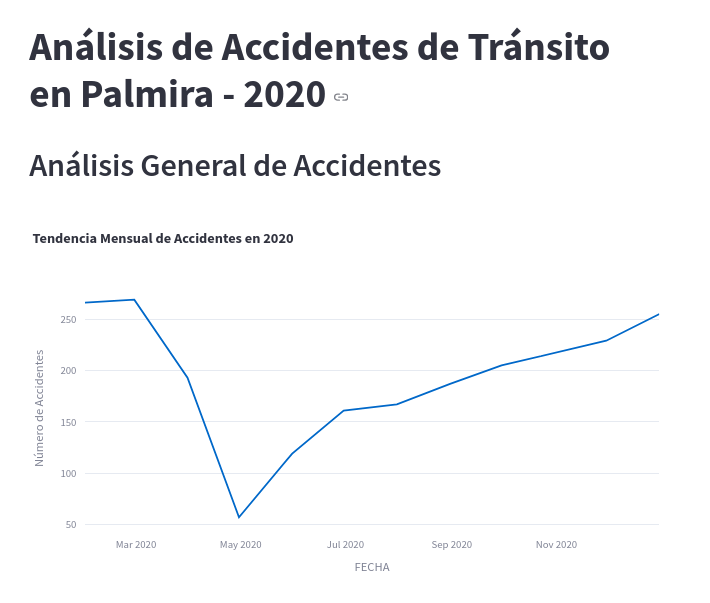

# Accidentes 2020

*Resumen*: Análisis de los accidentes de vehículos del año 2020 en la ciudad de Palmira, Valle, Colombia. Esta aplicación Streamlit permite explorar los datos a través de visualizaciones interactivas y filtros avanzados.

*Descripción*: La siguiente aplicación es un trabajo en proceso de construcción y un ejercicio académico personal continuo. Mi interés radica en aprender sobre programación en *Python*, el análisis de datos con *Pandas*, y la representación clara y comprensible de la información utilizando *Streamlit*. Considero que esta combinación de herramientas es ideal para el aprendizaje del *Análisis de datos*. Este desarrollo muestra mi progreso y habilidad, con el ánimo de seguir mejorando y practicando.

*Avances Recientes*:

- **Implementación de Filtros Avanzados:** Se añadió una barra lateral con filtros interactivos para permitir al usuario seleccionar el día de la semana y un rango de fechas específico para el análisis.
- **Agrupación de Gráficas en Subplots:** Las visualizaciones principales de análisis general y específico de motocicletas ahora se presentan en una estructura de subplots organizada para facilitar la comparación.

*Requerimientos*:

- pandas
- plotly.express
- folium
- streamlit_folium
- plotly (para `make_subplots`)

## Captura

La siguiente imágen es una captura de la aplicación en funcionamiento.



La [Aplicación en Streamlit](https://accidentes2020-leoperez.streamlit.app/) contiene la mayor parte de mi progreso en estos temas. Ahora, con la llegada de las IA's he podido desarrollar diferentes ideas durante el proceso de creación de la aplicación, pero, todavía me cuesta mucho la parte donde no sé que hacer con tandos datos y que responder con los datos. Sin embargo Tengo a mi nuevo *amigo digital* que me da ciertas recomendaciones no sin antes, quedar atento a los comentarios hechos por humanos reales.

### Recomendaciones de IA

Despues de llegar a cierto punto con la aplicación, decidí pasar por una IA para leer su recomendación y saber como podría mejorar. He copiado toda la recomendación y pienso dejarla en este *README.md* para recordar y realizar los cambios.

A medida que realice los cambios que me parezcan apropiados, seguramente los voy a ir borrando del texto.

### respuesta de la IA

```markdown
**Organización y Estructura:**

1. **Carpeta para Componentes Streamlit (Opcional pero Recomendable):** Si tu aplicación 
sigue creciendo y tienes lógica de interfaz de usuario más compleja, podrías considerar 
crear una carpeta para componentes personalizados de Streamlit. Por ejemplo, podrías tener 
funciones que generen selectores específicos, tarjetas de información, etc.

2. **Nombres de Archivos Descriptivos:** Los nombres `main.py` y `funciones.py` son 
bastante genéricos. Si tu archivo de funciones se enfoca en un área específica 
(ej. `graficos.py`, `mapas.py`, `data_processing.py`), podría ser más explícito a 
medida que el proyecto crece.

3. **Comentarios y Documentación (¡Excelente que ya los tengas!):** Sigue comentando 
tu código, especialmente las funciones en `funciones.py`. Considera usar docstrings más 
extensos en las funciones para explicar qué hacen, cuáles son sus argumentos y qué devuelven. 
Esto facilita la comprensión y el uso futuro de tus funciones.

**Funciones (`funciones.py`):**

1. **Manejo de Errores y Valores Faltantes:** En tus funciones de generación de gráficos, 
podrías añadir manejo para casos donde la columna especificada no exista en el DataFrame 
o tenga valores faltantes que puedan causar errores en la visualización.

2. **Flexibilidad en las Gráficas:** La función `generar_grafica_por_columna` es muy útil. 
Podrías hacerla aún más flexible permitiendo pasar argumentos adicionales a 
`plotly.express.bar`, como el título o los nombres de los ejes, directamente desde `main.py`.
```
